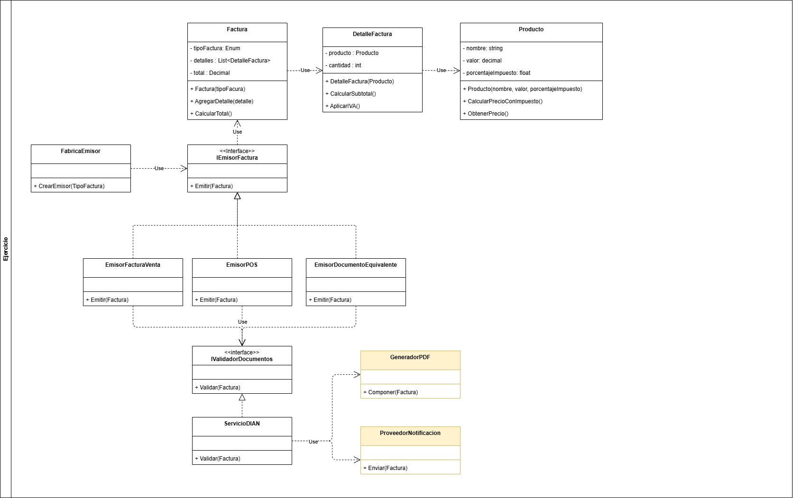

# Ejercicio propuesto

## Dominio

Luego de que las facturas son emitidas ante el ente gubernamental y este las aprueba, estas facturas deben ser notificadas a los clientes mediante un correo electronico que debe tener adjunto un archivo zip con la siguiente información:

- **Factura validada ante la dian**: Esta factura emitida, debe estar en un formato XML.
- **Representación gráfica de la factura**: Esta representación debe estar en formato PDF.

## Diagrama de clases

El desarrollador que tomó el requerimiento planteo la siguiente solución: Luego de que el *servicioDIAN* reciba la respuesta, si es aprobado, llama al método *Notificar* para que allí se use el servicio *GeneradorPDF* y *ProveedorNotificacion* y se cumpla con el requerimiento solicitado.

## Tarea propuesta

Deberá analizar si este diagrama tiene errores de diseño y proponer una solución nueva aplicando DIP + Low Coupling.
