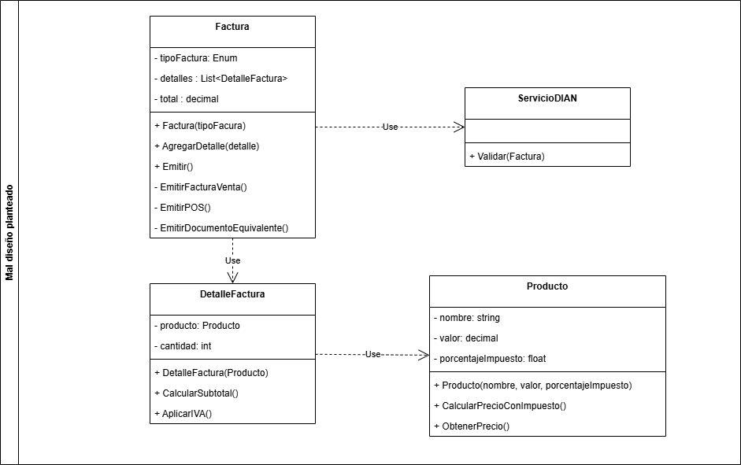
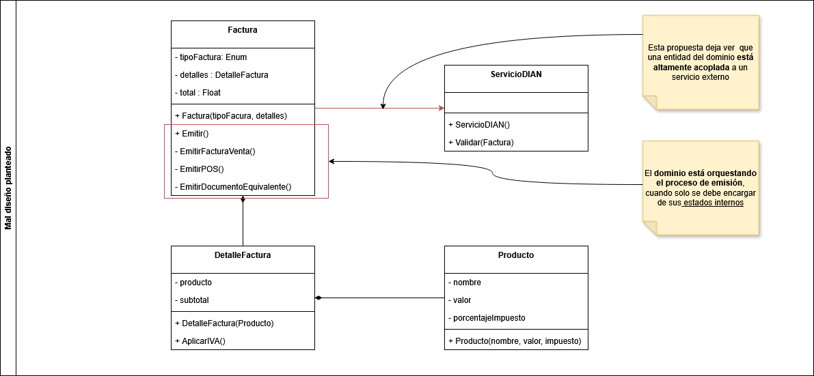

# Ejemplo de mal diseño

Para emitir facturas ante la DIAN, se deciden crear las clases :

- **Factura**: Representa el dominio de una Factura, esta compuesta de varios detalles. Tiene la responsabilidad de emitir la Factura ante la DIAN.
- **DetalleFactura**: Tiene los detalles de la factura. Esta compuesto por un producto.
- **Producto**: Representación de un producto, tiene la posibilidad de calcular el valor con impuestos y sin impuestos.
- **ServicioDIAN**: Permite validar las facturas emitidas ante la DIAN.

## Diagrama de clases

## Problema

Las clases expuestas para emisión de facturas ante la DIAN, son funcionales más no están bien diseñadas. Los principales problemas que hay dentro del diseño de las clases son:

| Smell | Descripción |
| ------- | ------------- |
| **Violación del Principio de Inversión de Dependencias (DIP)** | La clase `Factura` depende directamente de la clase `ServicioDIAN`, lo que genera un acoplamiento fuerte entre estas dos clases. Esto dificulta el cambio o la sustitución de `ServicioDIAN` por otra implementación, ya que `Factura` está directamente atada a esta clase específica. Además, la clase `DetalleFactura` depende directamente de la clase `Producto`, lo que también genera un acoplamiento innecesario y limita la flexibilidad del diseño. |
| **Falta de Abstracción** | No existen interfaces o abstracciones que permitan desacoplar las dependencias entre las clases. Esto va en contra del principio de diseño de bajo acoplamiento y alta cohesión. |
| **Responsabilidades mal definidas** | La clase `Factura` asume demasiadas responsabilidades, como la gestión de los detalles de la factura y la interacción con el servicio de la DIAN. Esto viola el principio de responsabilidad única (SRP) y contribuye al alto acoplamiento. |
| **Rigidez en la solución** | La clase `Factura` al ser el objeto que puede hacer todo, en el momento que exista algún cambio, siempre se tendrá que modificar esta clase. |
| **Framework Dependency Design** | La clase `Factura` está diseñada de manera que depende directamente de una implementación específica para la validación de facturas. Esto hace que sea difícil cambiar la tecnología subyacente sin modificar la clase, lo que reduce la flexibilidad y la capacidad de adaptación del sistema. |
| **Falta de Modularidad** | Las clases no están diseñadas para ser modulares, lo que significa que no se pueden reutilizar fácilmente en otros contextos o sistemas. Por ejemplo, la clase `Factura` no puede ser utilizada sin `ServicioDIAN`, lo que limita su aplicabilidad. |
| **Acoplamiento entre lógica de negocio y servicios externos** | La lógica de negocio de la clase `Factura` está directamente acoplada a la interacción con el servicio externo `ServicioDIAN`. Esto dificulta la prueba unitaria de la lógica de negocio sin depender del servicio externo. |
| **Falta de separación de preocupaciones** | Las clases no separan claramente las responsabilidades. Por ejemplo, `Factura` combina la lógica de negocio con la interacción con servicios externos, lo que complica el mantenimiento y la escalabilidad del sistema. |

