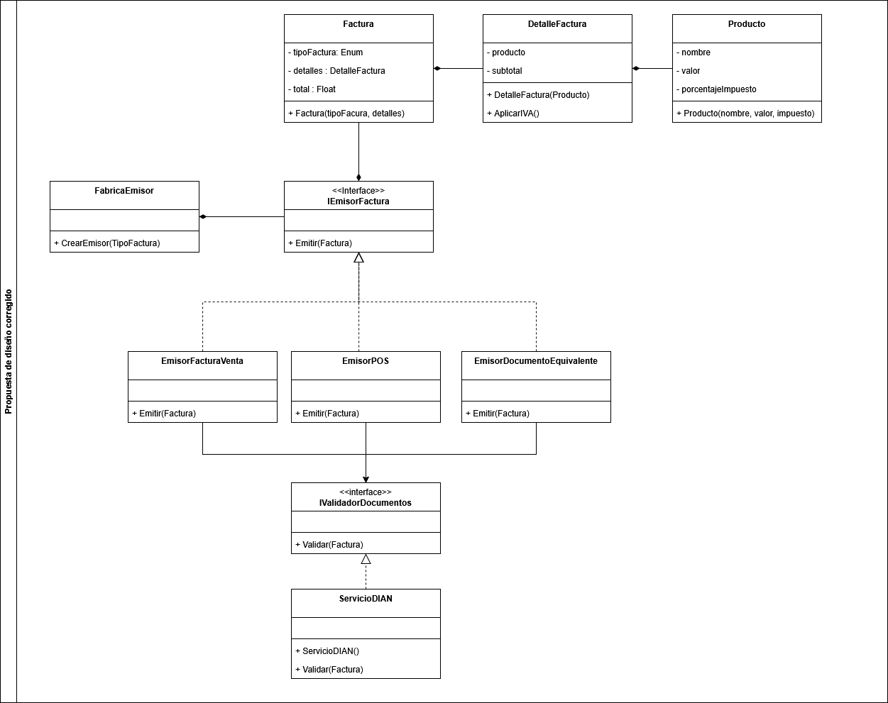

# Ejemplo con una propuesta de diseño aplicando DIP + Low Coupling

Teniendo en cuenta la propuesta funcional pero no escalable presentada anteriormente, se realiza una revisión de los problemas planteados y se propone la siguiente solución

## Diagrama de clases

## Justificación

Basado en los principios **Dependency Inversion Principle (DIP)** y **Low Coupling** se puede llegar a la conclusión que el [modelo presentado inicialmente](../bad_design/bad_design.md), tenía una clara violación a estos principios ya que el dominio estaba accediendo directamente a la infraestructura, esto generaba un alto acoplamiento y en caso de querer modificar o quitar el servicio gubernamental, nuestra aplicación dejaría de funcionar. Adicionalmente, todo el modelo dependía directamente de clases especializadas, lo cual no permite alterar el comportamiento de estas sin afectar el dominino, esto va en contra del principio DIP.

Nuestro sistema propuesto inicialmente, si bien era una solución funcional, no era una solución escalable, no tenía separación de conceptos y no era fácil de mantener en el tiempo.

La nueva propuesta, se ayuda del patrón de diseño creacional **Factory Method** para permitir que el modelo sea extensible en cuanto a las emisiones ante un ente gubernamental. Utiliza el principio **DIP** para que ninguna de las clases dependan directamente de otras clases sino de abstracciones, esto genera flexibilidad en el modelo. Finalmente quitó el alto acoplamiento que se presentaba entre el dominio y la infraestructura, llevando la relación a donde realmente debería estar y es en la capa de aplicación.
